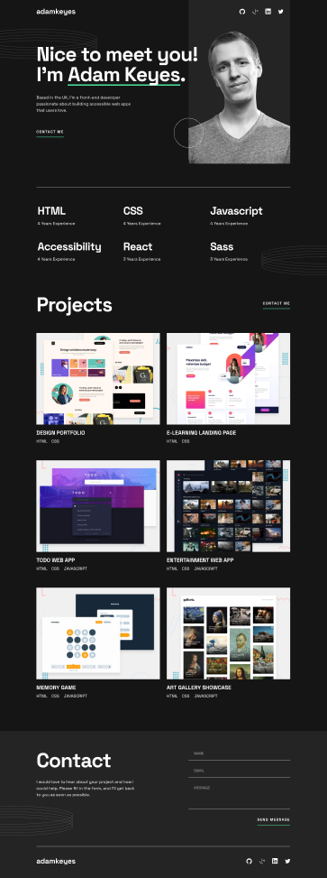

# Proyecto de Portafolio Responsivo

Este es un proyecto de portafolio responsivo creado para mostrar mis habilidades y trabajos utilizando HTML, CSS (Sass) y JavaScript. El diseño se adapta a diferentes tamaños de pantalla y está optimizado para dispositivos móviles, tabletas y escritorios.

## Vista Previa

## Tecnologías Usadas

- **HTML**: Estructura básica del sitio y contenido.  
- **CSS / Sass**: Estilos responsivos y diseño atractivo.  
- **JavaScript**: Funcionalidades dinámicas para mejorar la experiencia del usuario.  
- **Vite**: Herramienta de bundling rápida para proyectos modernos.

## Instalación

Clona el repositorio a tu máquina local:  
git clone https://github.com/martincarpovich/Portfolio-Responsive.git

Navega al directorio del proyecto:  
cd Portfolio-Responsive

Instala las dependencias con npm:  
npm install

Inicia el servidor de desarrollo:  
npm run dev

Abre tu navegador y ve a http://localhost:3000 para ver el proyecto en acción.

## Autor

[Martín Carpovich](https://www.linkedin.com/in/martin-carpovich/)

